## Objective

A quick introduction to the topics to be used in courses that require such introduction, including TAM's courses Ecologia Numérica and Modelação Ecológica at FCUL

but also to support the self paced learning github repository hosted at <https://github.com/TiagoAMarques/AnIntro2RTutorial>

The tutorial has a landing webpage (and hence looks a bit friendlier) here:

<https://tiagoamarques.github.io/AnIntro2RTutorial/>

::: footer
This presentation was created using [Quarto](https://quarto.org/) and [revealjs](https://quarto.org/). Want to try yourself. Check its amazing capabilities [here](https://quarto.org/docs/presentations/revealjs/demo/#/title-slide)
:::

## Obtaining the material

You can get all the material by downloading and unziping the [github repository](https://tiagoamarques.github.io/AnIntro2RTutorial/) contents. See image below: press the button at the end of the red arrow, then that of the blue arrow, and finally unzip the material into a folder of your choice.

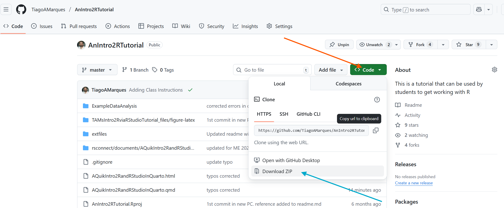{.absolute top="300" left="30" width="1000" height="400"}


## Learning goals

-   Obtain a working knowledge about the R software and environment, to be able to implement basic data analysis

-   Integration of R and RStudio, an helpful R interface, via a short introduction to R and RStudio followed by a hands on assisted tutorial

## The R environment

-   R is both a programming language and an environment for statistical computation
-   R is free open source software
-   Created in 1995 by Ross Ihaka and Robert Gentleman, Department of Statistics of the University of Auckland
-   gets its name from another famous programming language for data analysis, S
-   Project run by the "R Core Development Team"
-   Software and many resources available at the [r-project.org/](http://www.r-project.org)

::: footer
I am using version 4.3.1 (2023-06-16) (those guys are fast...this will probably be outdated!)
:::

## R: a selected timeline {background="#43464B" background-image=""}

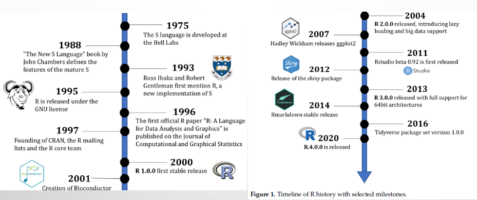{.absolute top="100" left="30" width="1000" height="500"}

::: footer
In Giorgi et al. 2022 The R Language: An Engine for Bioinformatics and Data Science Life 12: 648 DOI: [10.3390/life12050648](https://www.mdpi.com/2075-1729/12/5/648)
:::

## The R base + packages

::::: columns
::: {.column width="60%"}
-   R base installation comes with a number of libraries which provide access to a large number of commonly used features (e.g. linear models, survival analysis, basic statistical distributions, etc)
-   One of R's key strengths comes from the fact that many more packages are available online, under constant increase
:::

::: {.column width="40%"}
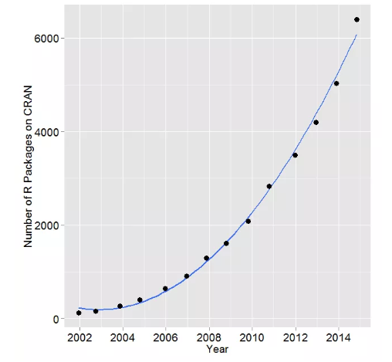{.absolute top="100" left="620" width="500" height="500"}
:::
:::::

::: footer
[image source at r4stats.com](http://r4stats.com/articles/popularity/)
:::

## The R environment

-   R was traditionally accessed solely via the command line, making the learning curve rather steep for beginners

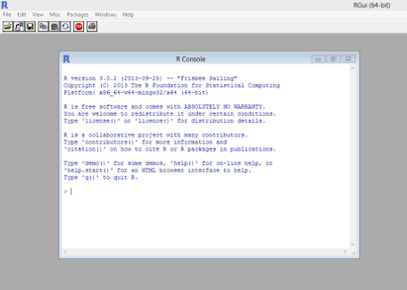{fig-align="center" style="border: 3px solid #dee2e6;" width="780"}

-   Here we focus on Rstudio, a program to interface with R, making many of the most common tasks simpler. Let's open Rstudio shall we?

::: footer
[Download RStudio here](https://posit.co/blog/rstudio-2022-07-0-what-s-new/)
:::

## RStudio

::::: columns
::: {.column width="65%"}
-   (as R) Free and open source
-   An integrated development environment for data analysis
-   Simplifies the user interaction with R
-   In a single application you have access to a number of windows containing the code, the command line, the figures, the help, a windows explorer, etc.
:::

::: {.column width="35%"}
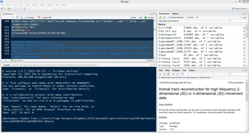{.absolute top="200" left="700" width="400" height="300"}
:::
:::::

## 4 windows, 4 ways to interact with R

{.absolute top="100" left="50" width="1000" height="600"}

## The code and plots tabs

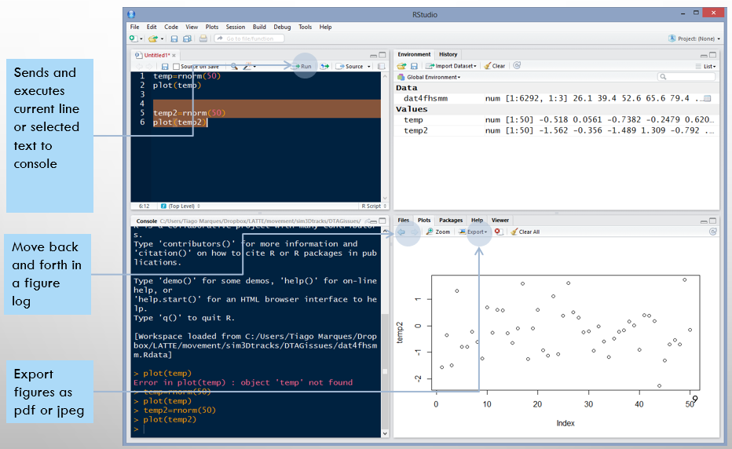{.absolute top="100" left="50" width="1000" height="600"}

## The environment tab

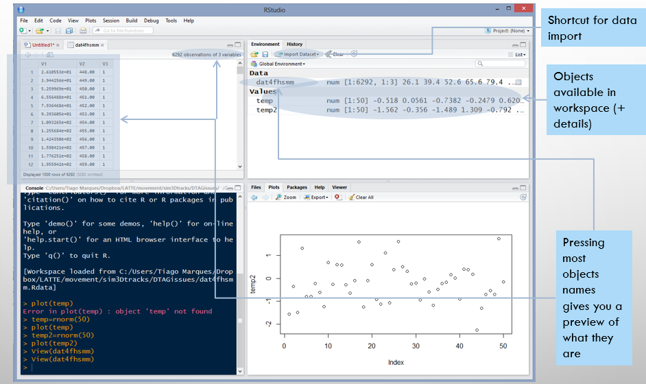{.absolute top="100" left="50" width="1000" height="600"}

## The packages tab

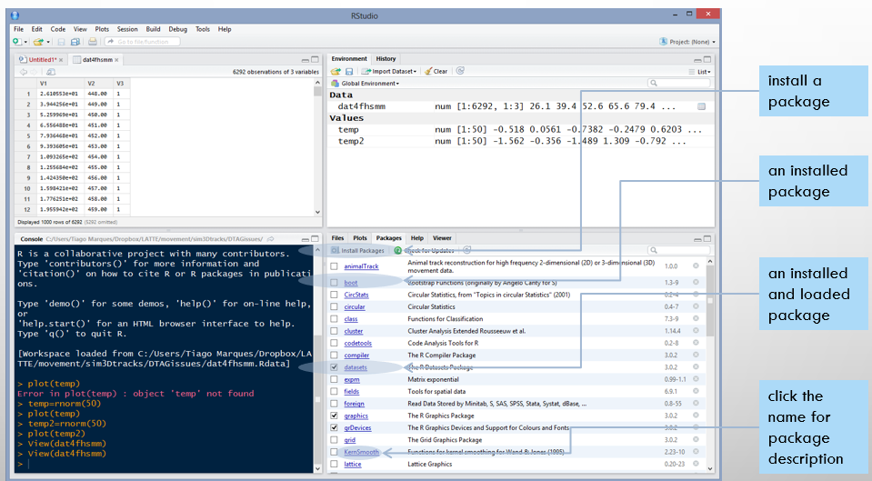{.absolute top="100" left="50" width="1000" height="600"}

## History and "windows explorer" tabs

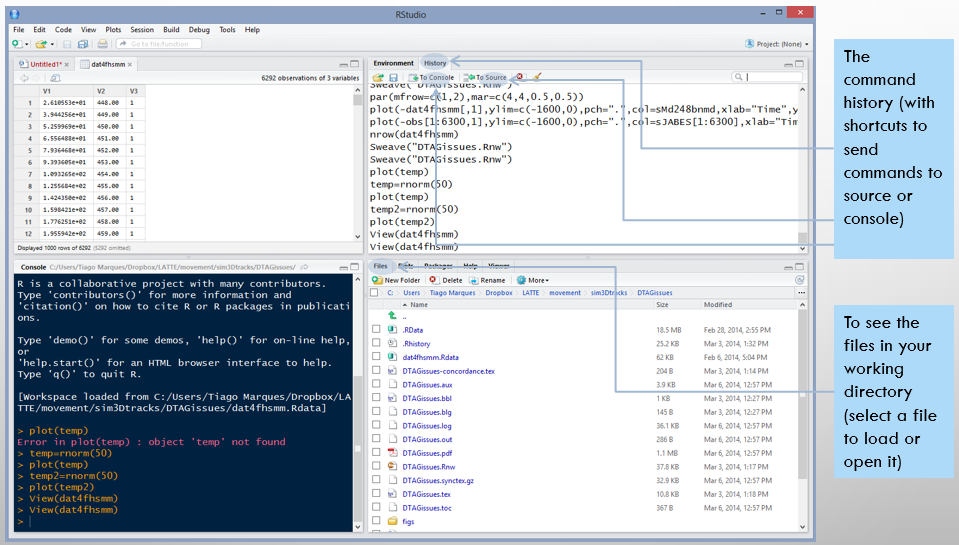{.absolute top="100" left="50" width="1000" height="600"}

## The help tab

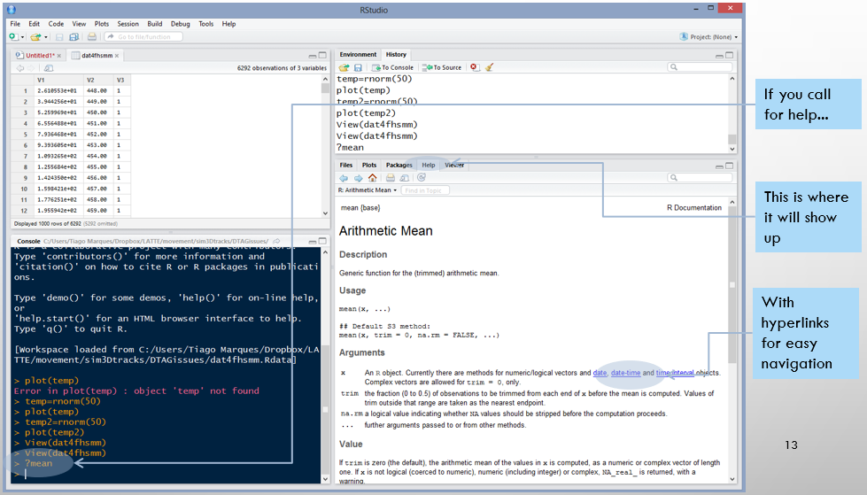{.absolute top="100" left="50" width="1000" height="600"}

## Aditional online resources

R HAS AMAZING (ENDLESS) ONLINE RESOURCES

<https://resources.numbat.space/index.html>

{.absolute top="200" left="150" width="600" height="450"}

::: footer
[Check also the landing page at my AnIntro2RTutorial github repos](https://github.com/TiagoAMarques/AnIntro2RTutorial)
:::

## R Markdown and Dynamic Reports

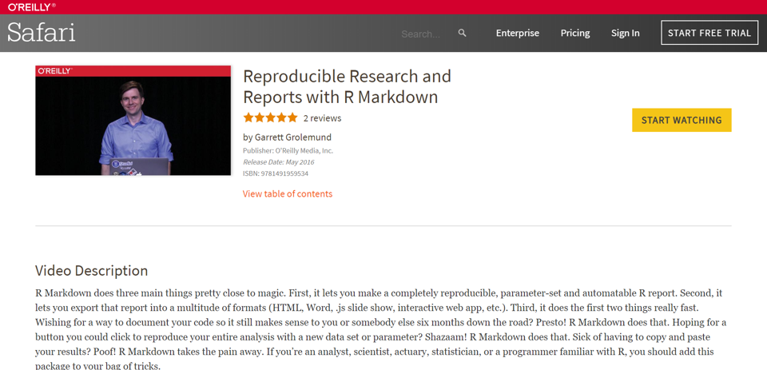{.absolute top="100" left="50" width="1000" height="450"}

::: footer
[Watch the above video here](https://www.oreilly.com/library/view/reproducible-research-and/9781491959534/video245667.html)
:::

## Creating a dynamic report I

Let us create a dynamic report from scratch in RMarkdown via RStudio

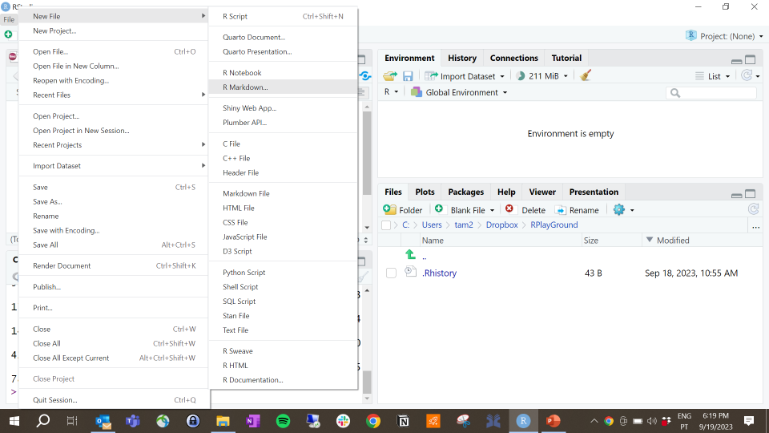{.absolute top="200" left="50" width="1000" height="450"}

## Set Title and author

Let us create a dynamic report from scratch in RMarkdown via RStudio

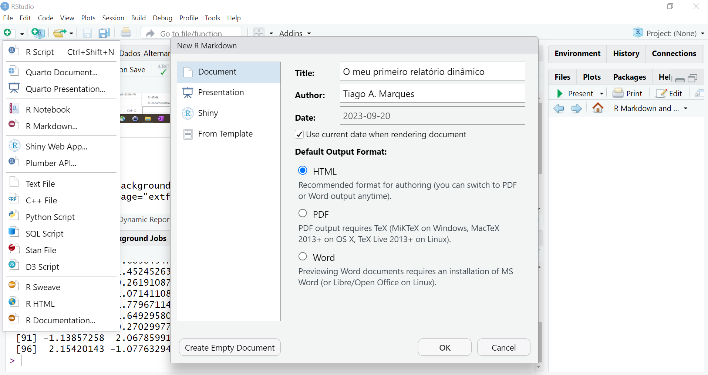{.absolute top="200" left="50" width="1000" height="450"}

## Almost there

This is what you should be seeing. Check your title and name are there.

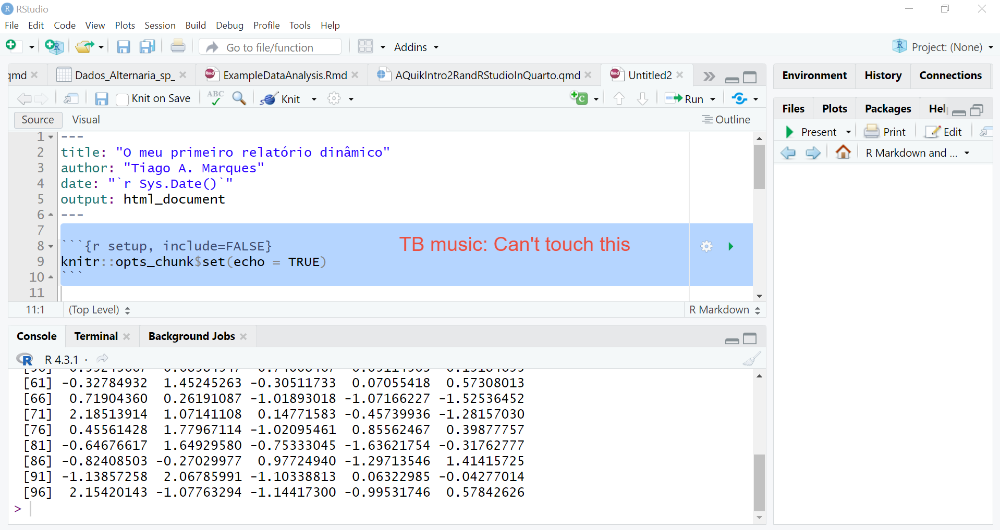{.absolute top="200" left="50" width="1000" height="450"}

## Compile the .Rmd

To do so press the "Knit" button. After you do you are asked to save the files, tell RStudio where it should do so it and what is the file name (I am using "My1stDynamicReport.Rmd")

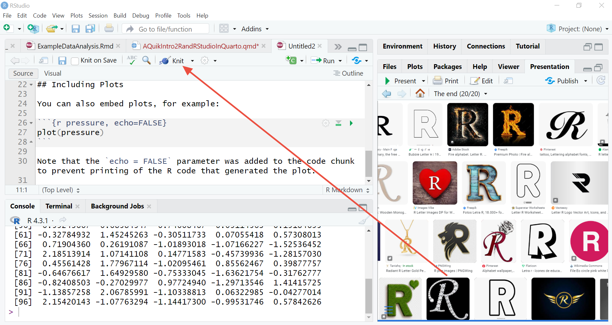{.absolute top="250" left="50" width="1000" height="450"}

## If you run into issues

Regarding "latin" characters showing, like say "é", "õ" and â"

{.absolute top="200" left="50" width="1000" height="450"}

## Et voilá

Your first dynamic report is ready

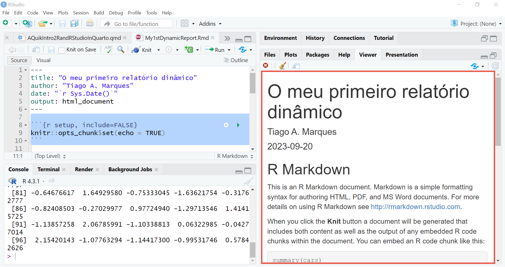{.absolute top="150" left="50" width="1000" height="550"}

## If you want it in the viewer pane

Unless you have customized RStudio to do otherwise, the html appears in a new window. To have it in the viewer pane, change the options under `Tools| Global Options`

{.absolute top="250" left="50" width="1000" height="500"}

## Possible outputs

-   Your now have your first HTML automatically generated, obtained from compiling (=knitting) the .Rmd file ("My1stDynamicReport.Rmd").

-   Actually, the output could also be a Word file or a PDF.

-   Not all possible features are available in word

-   Generating PDF's requires some additional software (LaTex) - you can try that on your own. Good luck ;)

## Experiment with the .Rmd file

-   Try to insert a new bit of code with `Code|insert chunck` (shortcut `Ctrl+Al+I`)

-   Change a chunck's options (e.g. `eval`, `echo`, etc) from `TRUE` to `FALSE` and see what whappens to the output

-   Try to use dynamic numbers like this one: 0.5564619 printing the mean value of 5 random Gaussian numbers. For that you need to use something like \`? mean(rnorm(5))\` (note: replace the "?" with the leter "r" so that it knows you want to run r code).

-   For more, check e.g. the [RMarkdown cheat sheet](https://github.com/rstudio/cheatsheets/raw/main/rmarkdown-2.0.pdf)

## Warning: command line vs .Rmd

{fig-align="center"}

-   When you run some code within a .Rmd, it is only run in the .Rmd

-   When you run some code in the command line, it is only run in the command line

-   Therefore, reading the data in the command line does NOT mean it will be available for a dynamic report, and vice versa!

## Tips and Tricks

-   It is much safer to compile the entire document than to run code chunks separately

-   An .Rmd is not a usual script, it has both code and text. The result is a dynamic document, with Text, Code, and OUTPUTS of the code

-   The code must go always, always, always inside a code chunck!

-   Comments to the code can also be within code chunks (preceded by "\#" -- the hash symbol).


::: {.cell}

```{.r .cell-code}
# EXAMPLE: this would be a comment
# run the next lines of code the result is 11
A<-3;B<-8;A+B
```

::: {.cell-output .cell-output-stdout}

```
[1] 11
```


:::
:::


## Useful RMARKDOWN web resources

-   An RMarkdown template with lots of tips and trick made just for YOU [here](https://github.com/TiagoAMarques/RMarkdownTemplate)

-   About R Markdown, the oficial site [here](https://rmarkdown.rstudio.com/)

-   The online free [book](https://bookdown.org/yihui/rmarkdown)

-   Chapter 27 on RMarkdown from the fRee online book: R FOR DATA SCIENCE [here](https://r4ds.had.co.nz/r-markdown.html)

-how to write a book with markdown, with several VERY USEFUL BOOK examples available for free [here](https://bookdown.org/)

BE PROACTIVE: EXPLORE RESOURCES

## And finally...

Open the hands on R tutorial ("TAMsIntro2RviaRStudioTutorial.pdf") and work through it

{fig-align="center"}

## If you are seeing this slide

It is because you either:

1.  have completed the tutorial (well done you, keep it going!)
2.  are being shown the slide in class by me/someone (and hence might do the tutorial next, go for it!)
3.  are not following the rules if working alone (shame on you ;), but hey, rules are meant to be broken, YOLO.

Next couple of slides are about learning more about R on your own. Besides all the stuff at the landing page of my github repository here:

<https://github.com/TiagoAMarques/AnIntro2RTutorial>

You can try a couple of things

## Teach yourself

A great place to start [Ten simple rules for teaching yourself R](https://www.dropbox.com/s/6j5byl93z54hcpw/journal.pcbi.1010372.pdf?dl=0)

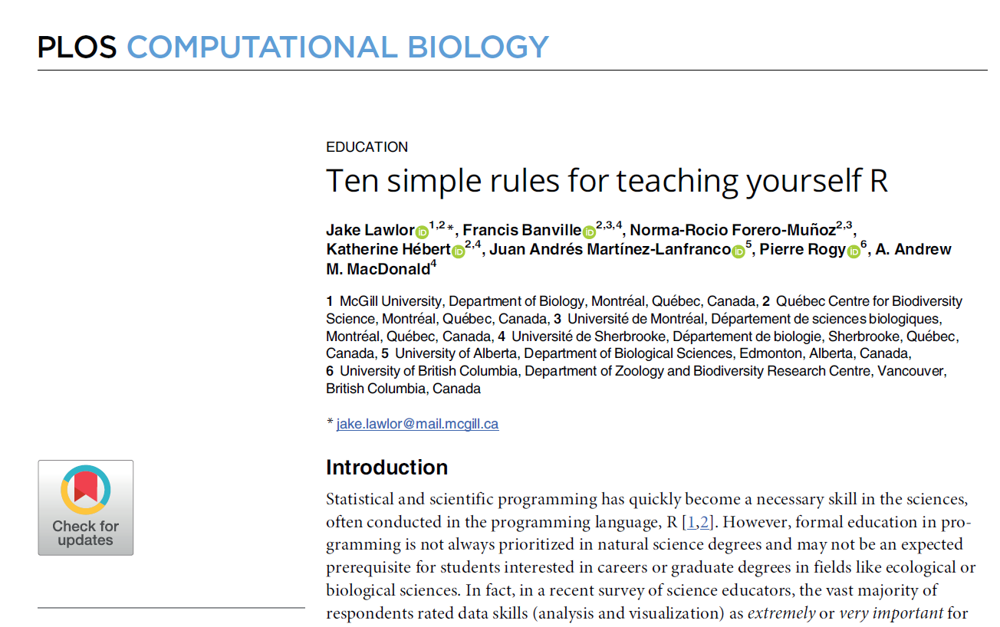{.absolute top="150" left="100" width="1000" height="600"}

## Get a (virtual) R Tutor

You can find one within the [swirl R package](https://swirlstats.com/): try it out!

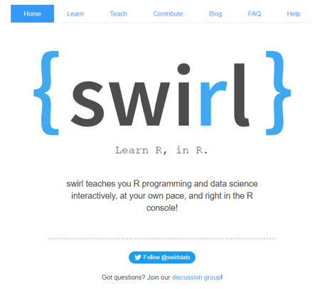{fig-align="center"}

## And now, off you go!

The path to R mastery is winding, but the reward is worth it...

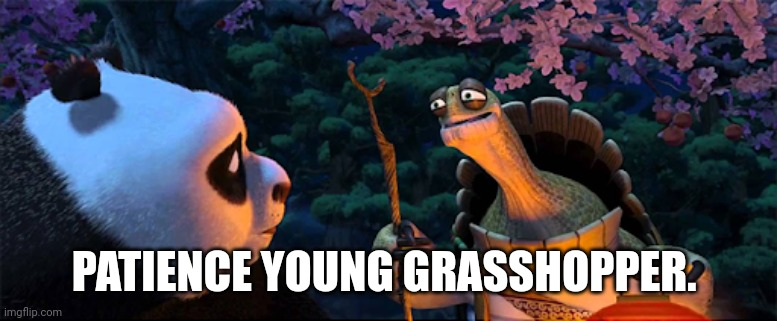{fig-align="center"}

## The end {background="#43464B" background-image="extfiles/backgRound.png"}

