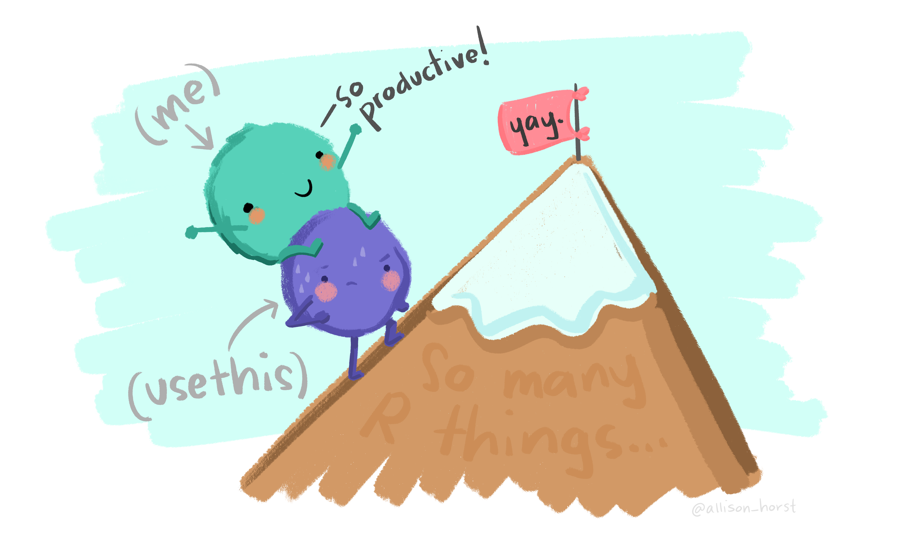
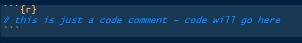

******

******

\newpage

# Before you start

## Where is this tutorial?

You might be reading this document as a pdf, a word or an html. This is in itself a dynamic report in RMarkdown (see more details about dynamic reports below). The .Rmd which, after compilation, creates them all, is available in the github repository located at:

https://github.com/TiagoAMarques/AnIntro2RTutorial

## Tutorial versions

This .Rmd was last compiled on `r Sys.time()`. The latest version of this tutorial is always available at the github repository above.

## Tips for non-UK native system users

You should avoid file names with anything other than small english-language letters as characters, including Latin characters like "é", "ã", "ô" or "ç", say. Also avoid spaces in file names. In short, make them short and easily readable, as possible. Also, you should be aware that some directories names can cause issues. If you are a user with those characters in the name, and you are working via a user with your name, then this applies to you. Finaly, be careful about some directories not having necessarily the name (for the system) that Windows shows you to have (examples for PT users: "Utilizador" vs "User" and "desktop" vs "Ambiente de trabalho").

# Introduction

This tutorial was created as a gentle introduction to the [R](https://www.r-project.org/) environment via the [RStudio](https://www.rstudio.com/) interface to R. While it could be a general introduction to R, the primary objective of this document is to serve as a "hands-on-tutorial" for courses delivered by me (TAM). I use it for both Ecologia Numérica and Modelação Ecológica, at FCUL, as well as for some other courses. It does not assume any previous knowledge about R, but some basic logic and programming notions would be desirable.

To facilitate the interaction with R we leverage on [RStudio](https://www.rstudio.com/), a piece of software which allows users to have at a click's distance many useful features in R. In the following sections of the tutorial you will be guided through a first session of R via RStudio.

The tutorial is intended to follow a brief presentation about R and RStudio, their interaction and capabilities ("Quick introduction to R and RStudio.pptx", also in this git repository). Since September 2023 there is also a shinny-new version of that presentation on RPubs: https://rpubs.com/talomarques/RRStudioRMarkdown 

This tutorial assumes that R and RStudio have been previously installed in the computer you are using. The latest version of both software packages is recommended. Both are free and open source.

Disclaimer: in this document I copy paste freely from other documents that I have written. Therefore, if you have read these words elsewhere by me, though luck. I claim the right to plagiarize myself here!

# Preliminaries about R

There is an extensive community revolving around R, and abundant courses, tutorials, books, blogs, list servers, etc, are freely available online. 

R might seem frightening at first, but even monsters can make something look more pleasant if you look from the right angle. It is all a matter of perspective :) So I will use the help of some monsters here to convince you that this is the right thing to do!

The amazing images in this document are all by Allison Horst, Artwork by '@'allison_horst, and I recommend you visit Allison's github repository filled up with amazing stats and maths illustrations (https://github.com/allisonhorst/stats-illustrations), including so many amazing resources to make R look less frightening. To be honest, this section is actually also an homage to Allison's outstanding work.


And it is not just about stats. If you do not understand how to find the derivative of a function after looking at Artwork by Allison Horst and her amazing visualization series on the topic, take it as a sign: just give it up, as I suspect you will never will!


Nowadays learning R by example is easy to do, with so many free online resources available to do so. 


I recommend that you do it via the RStudio environment, since it provides an integrated environment to integrate with all R things. And there are many! And if you do so, I can guarantee that in no time you will be having fRun.


The advantages of mastering R are priceless, but the learning curve can be daunting at first. 



This document is written in RMarkdown, a tool that allows you to build dynamic reports based on R code, providing integrated documents that contain all that is required for a given project, from reading the data in to final results and discussion, passing through all the analysis and results. If you want a gentle introduction to RMarkdown using a hands on tutorial based on a versatile template that will do many of the things you will need to get started, look for no more, there is also one here:

https://github.com/TiagoAMarques/RMarkdownTemplate

Go out and explore, little grasshopper. You will conquer many great things if you do. You will become a code giant one day. But never forget, you need to be thankful to an entire community, and you are standing on the shoulders of giants!


# External R resources that might be helpful

We provide here a small list of these that might be particularly helpful for beginners:

* [R webpage](http://r-project.org) - the main R webpage, including links to downloading R, manuals, tutorials, dedicated search engines, etc.

* [Swirl](https://swirlstats.com/) - if you want to learn R interactively from the command line, you might want to try this package. Your own R tutor at your fingertips. Try it!

* [R video tutorials](http://blog.revolutionanalytics.com/2013/08/google-video-r-tutorials.html) - video how to's in R

* [Online tutorial](http://www.datamind.org/) - a course with interactive exercises

* [Online course](http://faculty.washington.edu/tlumley/Rcourse/) -  notes for a two-day course in R

* [Reference card](http://cran.r-project.org/doc/contrib/refcard.pdf) - A very handy list of useful R functions

* [Short reference card](http://cran.r-project.org/doc/contrib/Short-refcard.pdf) - A longer reference card with most commonly used R functions

* [Cheat sheets](https://www.rstudio.com/resources/cheatsheets/) - an incredible useful set of resources from the RStudio team, where self contained subject specific sets of functions are provided for different common tasks

At the landing page of the github repository hosting this tutorial 

https://github.com/TiagoAMarques/AnIntro2RTutorial

there is a longer list of less introductory/general resources on R that might just have what you were looking for. Disclaimer: said list corresponds to a random non-exhaustive list of resources I have read and were useful to me at some point. I make no claims they might be useful to you :)

# Introduction to RStudio

Typically, if I am using this tutorial in a class room, the student will have been exposed to the PowerPoint `Quick introduction to R and RStudio.pptx`. If you are not in a class room, you might want to take a look at it. This is also available at the repository

https://github.com/TiagoAMarques/AnIntro2RTutorial

right about [here](https://github.com/TiagoAMarques/AnIntro2RTutorial/blob/0db9070cb440ea591a74744c64c17e3022830f43/Quick%20introduction%20to%20R%20and%20R%20Studio.pptx).

Nowadays most users (except perhaps die hard command line users) will use some sort of graphical user interface (GUI) to R. While the basic R installation comes with a simple GUI, here we adopt the use of RStudio, which considerably facilitates an introduction to R by providing many shortcuts and convenient features which we introduce next.

A major advantage of RStudio is that it makes it easy for you to type your R code into a script window, which you can easily save, and then send individual lines or blocks of code to the R command line to be acted upon.  This way, you have a record of what you have done, in the saved script file, and can easily reproduce it any time you like. We strongly recommend that you save your code script.

Given RStudio has been installed, when you double-click on a R workspace it should open in RStudio. Note that, if this fails, you might have to first associate .Rdata files with RStudio. After the presentation on R and RStudio you just sat through, from within RStudio you should be able to know where to find:

* the command line (bottom left pane \footnote{All the tab positions are the RStudio defaults, but this can be customized by the user later.})
* the code scripts (top left pane)
* the workspace objects (top right pane)
* the loaded packages and how to load them (bottom right pane)
* the created plots (bottom right pane)
* the help files (bottom right pane)
* a file navigator system akin to windows explorer (bottom right pane)

Note that you can customize the aspect of RStudio (e.g. font size and colors of the smart syntax highlighting scheme) via "Tools|Global options".

A very handy feature of RStudio is that you can preview the possible arguments of functions, as well as their description, directly when you are inserting the code. Let's try doing that. Type say `seq()` in the command line or the script window and then place the cursor between the parenthesis and press the "Tab" key... Is this a nice feature or what?

Now we have met RStudio and we know how it can make our life simpler, let's move on.

## Dynamic reports and reproducible research

One of the most amazing features of the integration of R and RStudio is how simple it becomes to work with dynamic reports, built on RMarkdown. This will take you to the next level in data analysis! Actually, this document was itself created as a dynamic report, using RMarkdown. You should explore some of the basics of R Markdown, and you can do so here: https://rmarkdown.rstudio.com/authoring_basics.html. You can find additional details here: https://rmarkdown.rstudio.com/. You can read an entire free book on the topic here: https://bookdown.org/yihui/rmarkdown/.

Experiment yourself to create one. In RStudio, select File - > New file -> R Markdown..., then just add a title, something like "My first dynamic report" and see what happens. Explore the content of the file just created and see what happens when you press the RStudio button `knit`. Experiment with the created document to try and change some of the output. Experiment in creating output as an html, as a pdf, and even as a Word document.

Actually, a good way to learn and get up and running fast in RMarkdown is by example. Hence, I have prepared a template that you can use to create without effort a nice dynamic report. Feel free to explore the material here:

https://github.com/TiagoAMarques/RMarkdownTemplate

Just download all the files into a folder, `knit` the file `RMarkdownTemplate.Rmd` and off you go. 

Imagine the potential when you are analyzing real data, and the data changes after your report is written!

A recent (well, on the 15th January 2021 it was recent. This wording might not age well!) note about latest features in RMarkdown is [here](https://blog.rstudio.com/2020/12/21/rmd-news/).

# A first quick session in RStudio

Here we present a brief introduction to R inside RStudio, using a script and the command line. In the coming sections we will mostly consider analysis using dynamic reports via RMarkdown documents (.Rmd), but it is useful to start with a session where you can see objects being created in the global environment.

Open RStudio. By default an empty workspace should appear. If you have an existing workspace, you can open it by selecting `File|Open File`. We recommend that you begin by creating a script file (`Ctrl+Shift+N`, RStudio Shortcut) and use that to save and comment all your code that will be executed during the tutorial. In this way you will have a record of everything you did.

You know that R is ready to receive a command when you see the R prompt on the command line (on the bottom left tab by default in RStudio): `>`. If you type a line of code that is not complete, R presents the `+` character, so that the user knows it expects the conclusion of the current line. 

**Important note**: while the prompt `>` and `+` might not be shown in this tutorial's code, they are often present in material online. You should not try to add either `>` nor `+` to the command line: this is  something that R does for you and will complain if you try to do it yourself! Past experience tells us that more than one person will have problems because they forgot to delete a `>` and/or `+`  from code when they copy paste the code into their own R sessions. Avoid being that person!

On the top right corner tab, where objects available in the `Environment` are listed, given this is a fresh R session, you currently have no objects. 

Here we just create a couple of objects and use them, but below we will do it again in more detail. Now we just want to create some objects so that we can then save them and retrieve them again.

```{r}
# assign the value 3 to the object hh2
hh2<-3
# assign the value 5 to the object hh3
hh3<-5
# multiply them up
hh2*hh3
# add them up
hh2+hh3
#note how you can write comments in R by using "#"
#anything in front of # is not interpreted by R
#and treated as a comment
#you should have the good habit of extensively commenting
#all your code so that you know what you've done
#when you return to it even months or years later
```

We can print an object to the screen by simply typing its name and press enter (despite the fact that currently you can actually see the values on these objects `Environment` tab - but that is because they are simple objects and the workspace is almost empty.).

```{r}
hh2
#same as 
print(hh2)
```

Tip: There is actually a simpler way to execute code from the script file in RStudio. `CTRL-Enter` is a keyboard shortcut for "source the current line of code in my script file and move the cursor to the next line". In general if you like keyboard shortcuts, look in RStudio under the menu `Help | Keyboard shortcuts` - there are probably many more than those you will be able to remember!

R is a very powerful calculator! Try some simple maths, say for example (you need to press enter after each line so that the line is evaluated)

```{r}
# R can add!
4+3
# and calculate a logarithm (here, of 8)
log(8)
#calculates the sin of a number (here of 3.1415)
sin(pi)
# or make any kind of calculation really
1234*sqrt(234)-12/23*4^(0.12-0.4)
```

R will do much more than that, of course. But it can be hard to get going. There will be hundreds or thousands of functions to choose from. The `print`, `log` and `sin` above were just three examples. If you want to know how to use a function, RStudio provides a very useful auto-completion code capability. Try to write this on the command line

```{r,eval=FALSE}
log()
```

and then put the cursor inside the function parenthesis and press the `Tab` key. RStudio will show you what are the arguments that the function can take (in this case, it's just the number you want the logarithm for, `x`, and `base`, the base of the respective logarithm). Remember this when you are using functions and unsure of what the corresponding arguments are.

It is now time to end our first R session. At this point you need to decide what to do, as all objects created so far are in the memory, but this will be wiped out unless we explicitly save it to a file. The easiest way to do so is by calling the `save.image` function

```{r}
save.image(file="my1stR.Rdata")
```

Note the unusual extension name `.Rdata` associated with R workspaces (an R file is called a workspace). We could now load up this workspace in a new R session, or typically we will load up that workspace by starting R by double clicking on the file created. Do this to see that you retrieve the above created objects. Note that if you already have an R session open, you can load up any previously saved workspace via function `load`.

Finally, just to avoid clutter later, we will delete all the objects created so far

```{r}
#deletes all objects in the dynamic report temporary memory
rm(list = ls())
```

Note that you have saved your workspace in some directory but you have not defined the directory explicitly. By default, this is your working directory. You can check what that directory currently is by using the following command

```{r}
getwd()
```

You can always change the directory you are working on by setting it up explicitly to your desired location, using 

```{r,eval=FALSE}
#set the working directory - but remember to use your own path!!!
setwd("C:/Users/tiago/Desktop/mycourse")
```

It is a very good habit to make sure that you are working in the directory you think you are working. Many errors might occur if R can't find some object or file because it is looking on the wrong place.

A good trick to make sure you are working in the directory you want is to open RStudio from the directory you want it to be working on. You can do that by double clicking a file R studio recognizes as a file it should open, e.g. as might happen in particular for files with extensions .R (a script), a .Rdata (a workspace) or a .Rmd (a dynamic report in RMarkdown).

If you are already in RStudio, you can also use the `Files` tab to see where you are, move to the folder where you want to be working, and then from the `Files|More` menu (a dented wheel) select the option `Set as working directory`.

Now you have used R in RStudio, let's use the power of their integration to work directly in a dynamic report.

# Working through R via a dynamic report

Create a new dynamic report using a RMarkdown file, as described above. Comment all you do in the appropriate place. At the end you will have a record that makes it easy to track everything you did, and a template you can use in future classes.

Once you created the RMarkdown from scratch, we can start by creating a new variable.

Note that all the code must go inside code chunks, and you can get them by doing `Code | InsertChunk` or the shortcut `Ctrl+Alt+I`.

An empty code chunk (in the image with a comment added to it!) looks like this:




We will create a variable called `myvar1` which we will assign the value of 4. This is typically done using the assign operator `<-`.

```{r}
myvar1<-4
```

There are typically multiple ways to do the same thing in R, and this is sometimes referred to as a disadvantage. For simplicity, we deliberately avoid presenting the several alternatives for each action, and concentrate on the ones we prefer. This is not the same as saying these are the best, and if you continue to work with R you will likely get used to doing things your way - for now we do it our way!
  
An object should have been created in your workspace. You can list all objects in a given workspace using

```{r}
ls()
```


You can also remove any object by using the`rm` function, so here we remove `myvar1`.

```{r}
rm(myvar1)
```

and hence our workspace is empty again. 

**Task 0**: Create some objects and assign numbers to them.  Then try to make some basic calculations with the objects you just created. Finally, clean up the workspace again.

Note a key difference between the functions `ls` and `rm`. While the first function does not need any arguments, the second requires at least one argument (but can take several). This can be easily seen by checking their help files and noting that `rm` needs at least 1 explicit argument while `ls` can work with defaults

```{r,eval=FALSE}
?rm
```

This is a convenient way to obtain more information about a given function. If one does not know what the name of the function might be, one can search for functions containing a given string. The following command lists all the functions with the string `mean` in them.

```{r}
apropos("mean")
```

Not surprisingly, most if not all of these functions will be used for some kind of calculation involving a mean. You can look into any one of them using the `?` as above. We have assigned a number to a variable , but we can actually more generally have vectors (strictly, `myvar1` was a numeric vector of length 1) containing a large number of values "inside" them. 

The following code assigns some numbers to 5 different vectors.

```{r}
x2<-c(1,2,0.12,4,-22)
x3<-seq(1,8,by=2)
# : useful shortcut for sequences with the by argument = 1
x1<-1:5
z1<-10:8
z2<--10:10
```

Take a peak at the objects just created:

```{r}
x1
x2
x3
z1
z2
```

The function `seq` is very useful for setting sequences of numbers. The optional arguments `length.out` and `along.with` provide extra flexibility. Look at `?seq` to find out what the function does and the consequences of using these different arguments.

We can use the usual mathematical operators over vectors. A few examples follow:

```{r}
x1+x2
x4<-x1+x2
x5<-x1-x2
x6<-x1*x2
x7<-x1/x2
```

Note by default you do not see results, you need to print them to the report to see them. As an example

```{r}
print(x4)
```

it is actually simpler than using print, because if you just use the name of the object on the console it gets printed by default

```{r}
x4
x5
x6
x7
```


Note that if the vectors are of the same length, R performs the operation element-wise. Another useful (but possibly dangerous) feature is that R recycles vectors if they are not the same length

```{r}
x8<-c(1,2,3,4)
x8+2
```

However, if one of the vectors is smaller, unexpected behavior can happen, because R recycles elements regardless (so be careful, a warning is typically produced)

```{r}
x9<-c(3,4,5)
x10<-c(0.7,0.9,1.3)
x9+x10
x8+x9
```

As expected, a warning message was produced when `x8` and `x9` were added. Usually *these messages are important and should be read*! Quite often the answer to your current question lies in the previous error or warning message.

Another useful function is `rep`, which allows one to create repetitions of patterns. As examples, see the difference between the next two lines of code

```{r}
rep(c(1,2,3,4),times=3)
rep(c(1,2,3,4),each=3)
```

We have just started R, created and removed some objects, and used simple functions like `ls`, `seq` or `save`. R is an object oriented language, and functions and vectors are just examples of types of objects available in R. In the next section  we go through the most commonly used classes of objects in R.

## Types and classes of objects

Objects can have classes, which allow functions to interact with them. Objects can be of several classes. We already used the class `numeric`, which is used for general numbers, but there are also additional very commonly used classes:


* `integer`, for integer numbers
* `character`, just for character strings
* `factor`, used to represent levels of a categorical variable
* `logical`, the values TRUE and FALSE


While many others exist, these are the more commonly used. Another type of object which we have already used are functions. 

```{r}
class(mean)
```

While there are thousands of available functions inside R, later we will learn how to create our own functions.

Outputs of some analyses have special classes, as an example, the output of a call of function `lm` is an object of class `lm`, i.e., a linear model. Many packages introduce special classes for objects, so that functions know how to behave when those objects are used as arguments. Typically, functions behave differently according to the class of the objects that are used as arguments to them. As an example, note how `summary` treats differently an object of class `factor` or one of class `numeric`, producing a table of counts per level for a factor but a 6 number summary for numeric values.

```{r}
obj1<-factor(c(rep("a",12),rep("b",4),rep("c",2)))
summary(obj1)
obj2<-c(2,5,-0.2,89,12,-3,-5.4)
summary(obj2)
```

We can check the class of an object using function `class`, as in the following examples

```{r}
class(obj1)
class(obj2)
class(TRUE)
```

It is sometimes useful to coerce, i.e. force, objects into different classes, but care should be used when doing so. Some examples are presented below. Can you describe in your own words what R did below?

```{r}
as.integer(c(3,-0.3,0.4,0.6,0.9,13.2,12))
as.numeric(c(TRUE,FALSE,TRUE))
as.numeric(obj1)
```

A common way to organize multiple vectors together is in the form of a matrix. Here we create such an object

```{r}
mat1<-matrix(1:12,nrow=3,ncol=4)
mat1
```

Note that by default R fills the first column (with 1,2,3) then the second column (4,5,6) etc.  If you want it to fill the first row, then the second, you can use the optional argument `byrow=TRUE`, like this:

```{r}
matrix(1:12,nrow=3,ncol=4,byrow=TRUE)
```

R also allows data structures with more than 2 dimensions -- we don't cover those here, but look up the help on ``array'' if you're interested. A matrix is just a two dimensional array. 

Arrays are useful objects, but can be complex to visualize due to their potential high dimensionality. Another common type of object is a `data.frame`. This is essentially a matrix but for which each column can be of a different type. These are what we would typically associate with an excel spreadsheet or a table in a database. Typically columns correspond to variables observed in a number of subjects, each subject recorded in its own row. A simple example with 3 variables and 5 subjects follows:

```{r}
mysex<-c("male","female","female","male","male")
myage<-c(34,23,56,45,12)
myhei<-c(185,178,167,165,148)
df1<-data.frame(ID=1:5,sex=mysex,age=myage,height=myhei)
df1
```

Typically, `data.frames` are used to store the data we subsequently analyse. Usually the data are not manually imputed as above, but read into R from other software, using R functions addressed in a later section.

A data frame is just a special type of `list`. A `list` can contain objects of different types and dimensions. An example is here

```{r}
list1<-list(Note="whatever I want here",X2=4,age=1:4)
list1
```

Lists are typically used to store outputs of computations which require different kinds of objects to be recorded. Note the use of `$` to access the sub components of a list or a data.frame.

```{r}
list1$X2+10
```

Alternatively, one might use index to retrieve elements of a list


```{r}
list1[[3]]+5
```

In the next section we will learn more about using indexes to access subsets of data.


# Subsetting data

One useful feature of R relates to how we can index subsets of data. The indexing information is included within square brackets:`[ ]`. As an example, we can select the 3rd element of a vector

```{r}
x<-c(1,3.5,7,8,-7,0.43,-1)
x[3]
```

but we can also select all except the second and third elements of the same vector

```{r}
x[-c(2,3)]
```

We can also select only the objects which follow a given condition, say only those that are positive

```{r}
x[x>0]
```

\noindent or those between (-1,1)

```{r}
x[(x>-1) & (x<1)]
```

Note the subtle difference between the previous and next statements

```{r}
x[(x>=-1) & (x<=1)]
```

\noindent which reminds us we should be careful when setting these logical conditions, especially when working with integer boundaries which might be on the limits of those conditions. Note indexing can be done using additional information. As an example, we select here the elements in `x` such that the corresponding elements in `y` are positive:

```{r}
#rnorm(k) produces k Gaussian random deviates
x<-rnorm(10)
y<-rnorm(10)
x2<-x[y>0]
```

When working on a matrix the indexing is done by row and column, therefore for selecting the value that is in the third row and second column of a matrix we use

```{r}
mat1[3,2]
```

\noindent but we can also select all the elements in the second row

```{r}
mat1[2,]
```

or the fourth column

```{r}
mat1[,4]
```

We are often interested in subsetting a dataset by some characteristic of one (or several) of its columns. Here we illustrate with the dataset `iris` (check `?iris` for data details) 

```{r}
head(iris)
str(iris)
```

that contains information about 3 species: `r unique(iris$Species)[1]`, `r unique(iris$Species)[2]` and `r unique(iris$Species)[3]`. Imagine that we want to do something just with those from species `r unique(iris$Species)[3]`. Then we can create an object holding just that information as

```{r}
iris.3 <- iris[iris$Species=="virginica",]
summary(iris.3)
```

# Mathematical functions 

Within R there are a number of mathematical operators but also mathematical and statistical functions. As any other functions, many of these have required parameters and optional parameters. It would take a very long time to describe even the most basic functions. Therefore, we prefer to let you try hands on explore a number of these.

**Task 1**: Take your time to explore the functions below: `sum(x)`, `sqrt(x)`, `log(x)`, `log(x,n)`, `exp(x)`, `choose(n,x)`, `factorial(x)`, `floor(x)`, `ceiling(x)`, `round(x,digits)`, `abs(x)`, `cos(x)`, `sin(x)`, `tan(x)`, `acos(x)`, `acosh(x)` , `max(x)`, `min(x)`, `mean(x)`, `median(x)`,  ` range(x)`, `var(x)`, `cor(x,y)`,
`quantile(x)`.

(Tip: do not forget that you can get a full description what each function can be used for, what arguments it takes, and what kind of output it produces,  using `?`. Further, the help of most functions includes examples of their use, which proves invaluable to understand their usage.)


# Importing and exporting data

Rather than importing data into R manually, typically the data we work with are imported from some external source. Typically this might be some simple file format, like a txt or a csv file, but while not covered here, direct import from say Excel files or Access data bases is possible. Such more specialized inputs often require additional packages.

RStudio includes a useful dedicated shortcut `Import dataset`, by default available through the top right window of RStudio's interface. Note this shortcut essentially just calls the appropriate functions required for each import. Here we present a couple of examples just for practicing.

First, we load up a data frame which exists in R (note R includes a large variety of example data sets which are useful to illustrate the use of code) and contains an example data set, with variables measured in 150 flowers of 3 varieties. This is in object `iris`, and we use the function `data` to load it so that we have access to it.

```{r}
data(iris)
```

we can take a look at what this data set contains

```{r}
#example of head use: see the first 4 rows in iris
head(iris,4)
#example of str use
str(iris)
#example of summary use
summary(iris)
```

Now we create a new data frame which we then modify to include a new variable

```{r}
mydata<-iris
mydata$total<-mydata$Sepal.Length+mydata$Sepal.Width+
mydata$Petal.Length+mydata$Petal.Width
```

Now, we are going to export this data set as a txt, named `mydatafile.txt`

```{r}
write.table(mydata,file="mydatafile.txt",row.names=FALSE)
```

Note the use of the optional argument `row.names=FALSE`, otherwise some arbitrary row names would be added to the file. If you look in the folder you are working in, you should now have a new file there. Open it and check that it looks as you would expect. Next, we are going to import it back into R, into an object named `indat`.

```{r}
indat<-read.table(file="mydatafile.txt",header=TRUE)
```

So now we have our data back in R.

**Task 2**: Import the file `dados1.csv` into R, giving it the name `newfile`. Tips: Explore the possible options including (1) `Import Dataset` shortcut in the `Environment tab`, which is usually a convenient way to find the right function with suitable defaults for your data (2) the optional arguments in function `read.table` above or (3) consider using function `read.csv`.

# Graphics

One of the most amazing R capabilities are its graphics customization properties. One can create pretty much any graphic output desirable. The plot function is, as we have seen before for function `summary`, a function that attempts to do something smart depending on the type of arguments used. Using the data set iris previously considered, plot examples are implemented below, with some optional arguments being used to show some of the possibilities to customize plots.

```{r}
#default use
plot(indat$Sepal.Length)
```

In the following example, R evaluates the class of one of the arguments as being a factor and hence tries to give you a sensible result, which is producing a boxplot of a numerical variable as a function of a factor.

```{r}
ys<-indat$Sepal.Length
xs<-indat$Species
#note use of ~ to represent "as a function of"
plot(ys~as.factor(xs))
```

Note the use of `~` to mean "as a function of"; this is also used below when specifying regression models, where the object on the left  of `~` will be the response variable and the objects on the right explanatory variables.

We now add some labels to a new plot, using directly function `boxplot` (which in the background `plot` above called), of sepal length as a function of species 

```{r}
ys<-indat$Sepal.Length
xs<-indat$Species
#note use of ~ to represent "as a function of"
boxplot(ys~xs,ylab="Sepal Length (in mm)",main="Sepal length by species")
#compare with this code - next line returns an error
#plot(ys~xs,ylab="Sepal Length (in mm)",main="Sepal length by species")
#making species be a factor - allows the plot below to work well
#xs<-as.factor(indat$Species)
#plot(ys~xs,ylab="Sepal Length (in mm)",main="Sepal length by species")
```

We can also set the graphic window to hold multiple plots. This is obtained via argument `mfrow`, one of the arguments in function. Note this function controls a much larger number of graphical parameters. You can take a look at its help file to get a feel for how many and what kind of control it allows you. An  example follows, in which we leverage on the use of function `with` to avoid having to constantly use `indat$` to tell R where the data can be found.

```{r}
#define 3 rows and 2 columns of plots
par(mfrow=c(3,2))
with(indat,hist(Sepal.Length,main=""))
with(indat,hist(Sepal.Width,main=""))
with(indat,hist(Petal.Length,main=""))
with(indat,hist(Petal.Width,main=""))
with(indat,plot(Petal.Length,Petal.Width,pch=21,col=12,bg=3))
with(indat,plot(Sepal.Length,Sepal.Width,pch=16,col=3))
```

We used argument `mfrow`, but looking at the help for function `par` gives you an insight to the level of customization one can reach with respect to these graphical parameters, via dozens of different arguments.

We can look at the correlation structure between all variables using function `pairs`.

```{r}
#note selection of just the first 4 columns, since the last is not numeric
pairs(indat[,1:4])
```

**Task 3**: Using data `cars`, create a plot that represents the stopping  distances as a function of the speed of cars. Use the `points` function to add a special symbol to points corresponding to cars with speed lower than 15 mph, but distance larger than 70m. Check out the function `text` to add text annotations to plots. Customize axis labels.

Note that we can control most, if not all, elements of a plot. As an example, see the following code, where I am controlling all sorts of aspects. Search the help file to understand what the arguments `mar` of function `par` does (sets margin sizes) as well as `plot`'s parameters `xlim`, `ylim` `cex`, `pch`, `col`, do. See `?par` to check all the graphical parameters you can control on plots.

```{r}
set.seed(1234)
par(mfrow=c(1,3),mar=c(8,4,0.5,0.5))
pesos<-rnorm(100,200,20)
sps<-rep(c("Carapau","Sardinha"),each=50)
boxplot(pesos~sps,xlab="Espécie",ylab="Peso",las=1)
boxplot(pesos~sps,xlab="Espécie",ylab="Peso",las=2,col=3)
plot(rnorm(10),rnorm(10),xlim=c(-3,3),ylim=c(-3,3),col="blue",cex=2)
points(rnorm(10),rnorm(10),col=6,cex=2,pch=2)
points(rnorm(10),rnorm(10),col="orange",cex=4,pch=17)
points(rnorm(10),rnorm(10),col="blue",cex=3,pch=21,bg="green")
```

Here and in class I will generally use R base for plots, but nowdays the cool kids tend to use the ggplot2 system (https://r-graph-gallery.com/ggplot2-package.html). It is worth to go and find out about it.

If you really want to get creative with your plots, and a great plot can be extremely useful in conveying a message, check out the gallery here: https://r-graph-gallery.com/ Lots of ideas, with the R code to use them with your data! 

# Extending basic capabilities via packages

While R base installation includes enough functions that getting acquainted with them could take several years, many more are available via the installation of additional packages available online. A package is just a set of functions and data sets (and the corresponding documentation plus some additional required files) which usually have some specific goal. As examples, in our course we will be using packages `vegan` and `mgcv`, which allow the implementation of a variety of numerical ecology techniques and generalized additive models (GAM), respectively.

Note packages cover a very wide range of applications, and chances are that at least a package, often more than one, already exists to implement most kinds of statistical or data processing tasks we might imagine.

Installing a new package in R requires a call to function `install.packages`. A RStudio shortcut is simply to follow the `Tools|Install packages...` shortcut.

After a package is installed it needs to be loaded to be available. In R this is done calling function `library` with the package name as an argument. In RStudio this becomes simpler by checking the boxes under the RStudio tab packages (by default this tab is available on the bottom right window, along with the Files, Plots, Help and Viewer tabs).

We use `vegan` as an example. Notice to begin with that `vegan` is not available yet

```{r,eval=FALSE}
#
?vegan
```

Next, we install the package.

```{r,eval=FALSE}
#
install.packages("vegan")
```

(note: do not install packages within a dynamic report, that would be a akin to installing Word everytime you wanted to work on a document!)

Then, we load the package

```{r}
#
library("vegan")
```

and finally we check that the functions in it are now loaded

```{r,eval=FALSE}
#
?vegan
```

We would now be ready to do all sorts of classification and ordination techniques, say.

**Task 4**: Run the example code available in the help page from the function `cca`. Try to understand what is happening.

```{r,eval=FALSE}
#here are the relevant lines of code to run
data(varespec)
data(varechem)
## Common but bad way: use all variables you happen to have in your
## environmental data matrix
vare.cca <- cca(varespec, varechem)
vare.cca
plot(vare.cca)
```

# Analysis example: regression

One of the most common type of data analysis is a regression model. Despite common and conceptually simple, it is a very powerful way to understand which (and how) of a number of candidate variables, sometimes referred to covariates, independent or explanatory variables, might influence a dependent variable, also often referred as the response. There are many flavors of regression models, from a simple linear regression to complicated generalized additive mixed models. We do not wish to present these in any detail, but to introduce you to some functions that implement these models and the syntax that R uses to describe them.

Let's start with the basics. You have used the `cars` data set above. We use it here again to try to explain the distance a car takes to stop as a function of its speed. We start with a linear model using function `lm`.


```{r}
data(cars)
mylm1<-lm(dist~speed,data=cars)
```

We have stored the result of fitting the model in object `mylm1`. The function `summary` can be used to print a summary of the fit

```{r}
summary(mylm1)
```

Do not get frightened about all the output. The coefficient associated with speed tells us what intuition alone would anticipate, the higher the speed, the larger the distance a car takes to stop. The easier way to see the relationship is by adding a line to the plot (note this is a similar plot to what you should have created in task 3 above!). The predicted relationship is shown next:

```{r chunck159}
xl<-"Speed (mph)"
yl<-"Distance (m)"
plot(cars$speed,cars$dist,xlab=xl,ylab=yl,ylim=c(0,120),xlim=c(0,30))
abline(mylm1)
```

Note how function `abline` is used with a linear model as its first argument and it uses the parameters in said object to add a line to the plot. The optional arguments `v` and `h` are often very useful to draw vertical and horizontal lines in plots.

**Task 5**: Use abline to draw dashed lines (tip, use optional argument `lty`=2) representing the estimated distance that a car moving at 16 mph would take to stop.

Note that the line added to the plot represents the distance a car would take to stop given its speed. Oddly enough, it seems like a car going at 3 mph might take a negative time to stop, which is just plain nonsense. Why? Because we used a model which does not respect the features of the data. A stopping distance can't be negative! However, implicit in the linear model we used, distance is a Gaussian (=normal) random variable. We can avoid this by using a generalized linear model (GLM). Now the response can have a range of distributions. An example of such distribution that takes only positive values is the gamma distribution. We implement a gamma GLM next

```{r}
#fit the GLM
myglm1<-glm(dist~speed,data=cars,family=Gamma(link=log))
#predict using the GLM for speeds between 1 and 30
predmyglm1<-predict.glm(myglm1,
newdata<-data.frame(speed=1:30),type="response")
```

Our model now assumes the response has a gamma distribution, and the link function is the logarithm. The link function allows you to change how the mean value is related to the covariates. This becomes rather technical rather fast. Details about GLMs are naturally beyond the scope of this tutorial. References like @Faraway2006 or @Zuur2009b will provide further details in an applied context. The predicted relationship is shown in the next figure.

```{r}
#create a plot
plot(cars$speed,cars$dist,xlab="Speed (mph)",
ylab="Distance (m)",ylim=c(0,120),xlim=c(0,30))
#add the linear fit
abline(mylm1)
#and now add the glm predictions
lines(1:30,predmyglm1,col="blue",lwd=3,lty=3)
```

However, this GLM still requires that the response is linear at some scale (in this case, on the scale of the link function). Sometimes, non-linear effects are present. These can be fitted using generalized additive models. A good introduction to GAMs is provided by @Wood2006 and @Zuur2009b.

So finally we fit a GAM model to the same data set. For that we require library `mgcv`. The outcome is shown below. Here the fit is not very different from the GLM fit, but under many circumstances a GAM might be required over a GLM. We will see such an example in the next few days, when we model the detectability of beaked whale clicks as a function of distance and angle (with respect to hydrophones).

```{r}
#load the mgcv library
library(mgcv)
#fit the GAM
mygam1<-gam(dist~s(speed),data=cars,family=Gamma(link=log))
#predict using the GAM for speeds between 1 and 30
predmygam1<-predict(mygam1,newdata=data.frame(speed=1:30),
type="response")
```

```{r}
#create a plot
plot(cars$speed,cars$dist,xlab="Speed (mph)",
ylab="Distance (m)",ylim=c(0,120),xlim=c(0,30))
#add the linear fit
abline(mylm1)
#and now add the GLM predictions
lines(1:30,predmyglm1,col="blue",lwd=3,lty=3)
lines(1:30,predmygam1,col="green",lwd=3,lty=2)
```

# Simulation and random number generation

Another powerful use of R is for simulation. To this end, R has the ability to simulate random deviates from a large number of distributions. Perhaps the more useful and commonly used are the uniform and the Gaussian distributions. We now create 50 random deviates from each of these, as well as some Poisson deviates, for illustration

```{r}
#generate 50 pseudo-random Guassian numbers with mean 20 and standard deviation 3
rdnorm<-rnorm(50,mean=20,sd=3)
#generate 50 pseudo-random  50 uniform numbers between 3 and 6
rdunif<-runif(50,min=3,max=6)
#generate 50 pseudo-random  50 Poisson numbers with mean 6
rdpois<-rpois(50,lambda=6)
```

R can create random numbers from many different distributions (see help(Distributions) for a list) -- the relevant functions generally start with r and then an abbreviated distribution name (`rbinom`, `rexp`, `rgeom`, etc). Additionally, R also includes the ability to obtain the density function, distribution function and quantile function via the `d`+name, `p`+name and `q`+name functions. As an example, the Gaussian function usage of these functions is presented below

```{r}
dnorm(0,mean=0,sd=1)
pnorm(0,mean=0,sd=1)
qnorm(0.975,mean=0,sd=1)
```

**Task 6**: Using what you have learnt here, create two histograms, one of 50, another of 5000, random deviates from a Gaussian distribution (you can choose the mean and standard deviation you prefer!), using the optional argument `freq=FALSE` (leading to an estimate of the density function). Then add a line to the plot that represents the true underlying density (tip, you can use function `dnorm`), and comment on the results. You can also do similar experiments with other distributions. How weird are a beta(1,1), a beta(1,5) and a beta(0.5,0.5) distributions (tip, you can use function `dbeta`). Can you guess which one is sometimes referred to as bath tub distribution. What might be a beta useful for?

# Programming tricks

Some very useful programming structures are those required to evaluate conditional statements and those used to repeat statements many times. These are fundamental for implementing simulations. In R we have `if` statements and `for` loops, respectively.

As an example, see how an if statement works

```{r}
X=2
if (X>0) print(X+3)
```

One can also use an if-else statement, which executes either (1) something or (2) something else, depending on the condition being TRUE or FALSE. Here's an example:

```{r}
X=2
if (X>0)
  {Y=abs(X)} else 
  {Y=X^2}
Y
X=-5
if (X>0)
  {Y=abs(X)} else 
  {Y=X^2}
Y
```

on the other side, here's how a for loop works

```{r}
n=4
X=1:n
for (i in 1:n) print(i+3)
```

note there is nothing special about the use of i for an index; you can use any index that you might want

```{r}
n=4
X=1:n
for (j in 1:n) print(sum(c(j,j+3)))
```

or even

```{r}
n=4
X=1:n
for (i in X) {
  cat(paste("The i currently is:",i),sep="\n")
  cat(paste("The i+3 currently is:",i+3),sep="\n")
  }
```

See above, explore R. Change the code. Repeat. Check for yourself what `cat` and `paste` can be used for!

**Task 7**: Create 9 histograms of samples of Gaussian random variables, adding the mean value on the plot as a vertical dashed line, in blue if the mean of the observations is positive and in red if the mean of the observations is negative.

Other interesting structures for "control flow" are the `while`, `repeat` and `break`. Look into the help, `?if`, to see details.

# Writing your own functions

While the above functions, and the many more available, make R a very useful tool, there are sometimes problems which require a special tool. For these, we can create our own functions. Note this is an advanced topic.

The way of doing that follows a specific syntax

`> name <- function(arg1,arg2,...) {what the function does goes here}`

As an example, we create a function that returns the sum of its 2 arguments:

```{r}
myfun<-function(i,j){
  myres<-i+j
  return(myres)
}
```

You can now see the function in the works

```{r}
myfun(3,5)
```

Note a function could have many arguments, none, or just one.

**Task 7**: create a function called `mystats` which returns the mean, variance, maximum and minimum of the first, and only, argument (a vector). Then, update your function such that it can also return the mean excluding the negative numbers. Then, create some other function you might think could be useful.

Creating your own functions will unleash strong R power, increasing significantly your ability to manipulate, analyze and simulate data.

# Final tasks

These tasks are only intended for the students in Modelação Ecológica. If you are a Ecologia Numérica student you can try it at your own risk! If you are neither of those, then feel free to work through the material regardless.

## A final task integrating all of the above

Here we will implement an exercise were we pretend we are sampling an animal population, using some (very basic) simulations to understand the process better. Create plots that represent all the steps of your task, with proper legends, labels, colors, etc, and add all your comments to the dynamic report.

This exercise simulates a distance sampling survey. If you want to know more about it, you can check this 2 page introduction paper on the topic [here](https://github.com/TiagoAMarques/AnIntro2RTutorial/blob/40f353b63cb465c36dfa8f358e0e0d1cba45967a/Marques2009b.pdf). It is one of the most often used methods to estimate the abundance and/or density of wildlife populations.

1. Simulate the positions of 10000 animals in a study area, with length 10km and width 1km. Assume that any animal has an equal chance to be at any location in the study area (this corresponds to a uniform density surface). 

2. Generate a transect at a random location along the study area. 
3. Assume that you can potentially detect at most animals up to 500 meters from your transect. Count all the animals that you would detect if detection was perfect across your transect.

4. Consider that  animals far from your transect are harder to detect - yes, you are doing distance sampling! Define a function that represents a distance sampling half-normal detection function. If you do not know what that looks like check [here](https://workshops.distancesampling.org/online-course/lecturepdfs/Ch1/L1-4%20Choosing%20a%20Detection%20Function.pdf), around slide 9. Assume that sigma=200m. 

5. Simulate the detection process and get a sample of those animals detected. This is the hard bit, creating an animal detector. Tip: using `runif` will help. Ask me for details if you need them.

6. Create a plot that allows you to estimate (at this stage just a visual guess is needed) the detection probability. 

7. Repeat the sampling process 500 times, and store the number of animals detected in each one of your simulated surveys.

8. plot the distribution of the number of animals that you would detect each new survey.

Take your own conclusions about all that you did. 

## Creating your own statistical test via resampling

**This is work in progress**

We are all used to implementing statistical tests. But statistical tests for the situations one might face with real ecological data are not always available. For that reason, it might be useful to know how to create your own statistical tests. One can do that if one is able to create a test statistic, that contains information about the hypothesis one wishes to test, and for which we can simulate the distribution assuming that the null hypothesis is true.

Let us consider an example where we have data from camera traps, and we want to see if there is some relationship between two species. In particular, we want to see if the  use of the area covered by the camera is dependent on what species were present there before.

Imagine we have a camera trap and we collect the order in which different species appeared on the camera.

```{r}
#the exercise is more interesting if you do not think about how the data is being created
#later you can look at it, but for now, just treat this as a black box
#so all get the same answers
set.seed(189)
species<-c("wolf","bear","deer","racoon","weasel","bobcat","badger","squirel","sheep")
abundances<-c(50,20,300,500,500,50,400,1000,200)
appearences<-rep(species,times=abundances)
n<-length(appearences)
appearences<-appearences[sample(1:n,size = n,replace=FALSE)]
```

The code above has simulated such data, creating `r n` sequential occurrences of 9 different species. Here's the number of observations per species

```{r}
barplot(table(appearences))
```

We can see the first few detections

```{r}
head(appearences)
```

Recent research indicates that squirels tend to appear after weasels appear, and you have been tasked with looking into the data to test whether that seems to be the case at this site. How can you do it?

You will immediately realize this puts you in a context that you have not learnt any statistical significance tests that sound useful here. You need to create your own test. This can be done as a resampling/permutation test.

You first define a null hypothesis. That could be

H0: the appearance of a squirrel does not depend on badgers having been present

Next, you need to get a test statistic. It seems like a good test statistic would be the number of times a squirrel is preceded by a badger.

How can we calculate that for our data?

```{r}
#get each appearence
firsta<-appearences[1:(n-1)]
#get the next one
seconda<-appearences[2:(n)]
#get the pairs
paireda<-data.frame(fa=firsta,sa=seconda,pa=paste(firsta,seconda,sep="."))
#now, it's easy to count how many squirel-badger sequences we had
test.stat<-sum(paireda$pa=="squirel.badger")
test.stat
```

The key question is, under H0, is the value `test.stat` extreme, leading to rejecting H0, or quite expected, leading to no evidence to reject H0?

What do you think? How can you find a distribution for the test statistic under H0 so that you can formally evaluate whether to reject, or not, H0.

# Wrap up 

A full introduction to R course could take an entire week. A full course in regression modelling with R could take an entire semester. A full course of data analysis in R could take a life time.

Our objective with this tutorial was simply to introduce you to R such that when we use R in the next few days, the commands do not look too esoteric. Nonetheless, this material, as well as the references provided, should constitute a good basis to learn R further if you so desire.

Beginners find the R learning curve is often steep, but once mastered, R simplifies enormously the task of statistical data analysis.

Finally, to promote good habits, we clean the workspace. An organized workspace is very important!

```{r}
#cleaning the workspace
rm(list = ls())
```


# Acknowledgements 

Several people have provided comments over the years, typically when exposed to the tutorial, including colleagues, folks that have used it as teachers, or students asking questions in a course using the tutorial, like R courses, PAM DE courses, and Modelação Ecológica and Ecologia Numérica courses at DBA, FCUL. I thank their kind contributions here: Danielle Harris, Len Thomas, Soraia Pereira, Susana França, Sofia Reboleira, Sónia Coelho,  Afonso Barrocal and José Pedro Granadeiro. Many are not named explicitly, as I've forgotten about the specifics, but I thank them any way! If you think your name is missing, let me know. Further, this list is ever evolving and so, if you have comments, please, send them my way and get your name added to it! Indeed, fame for eternity is indeed that close :)

# References


